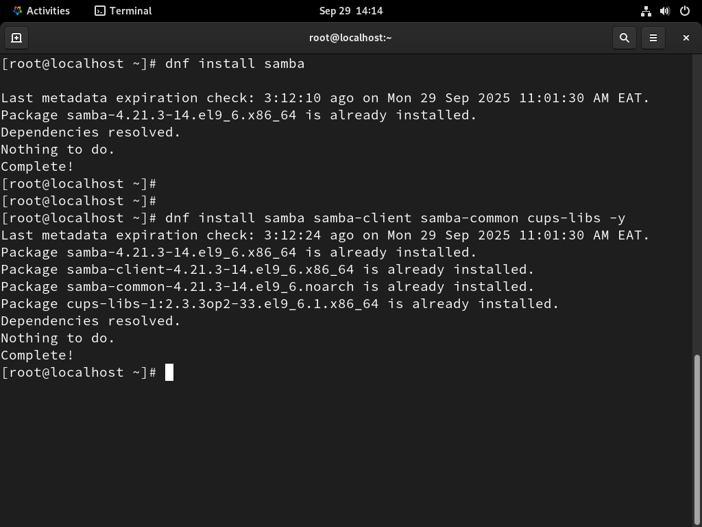
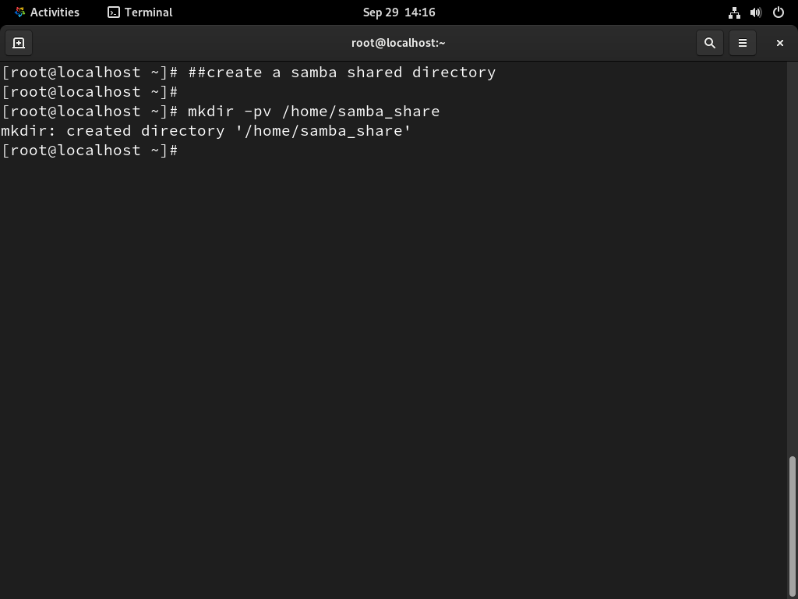
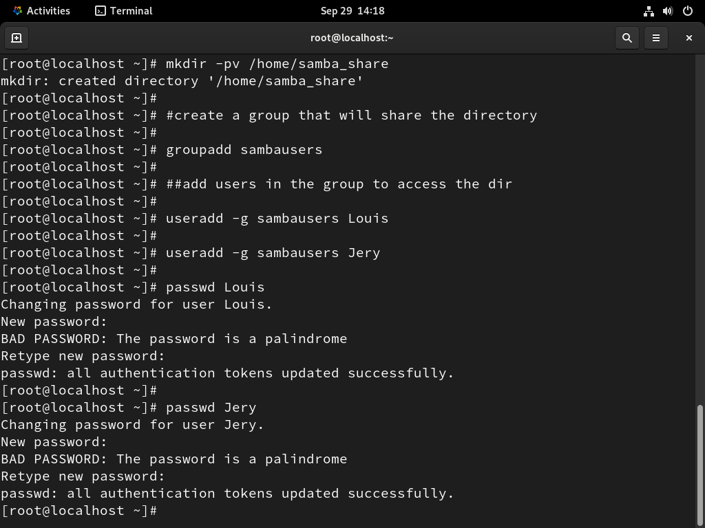
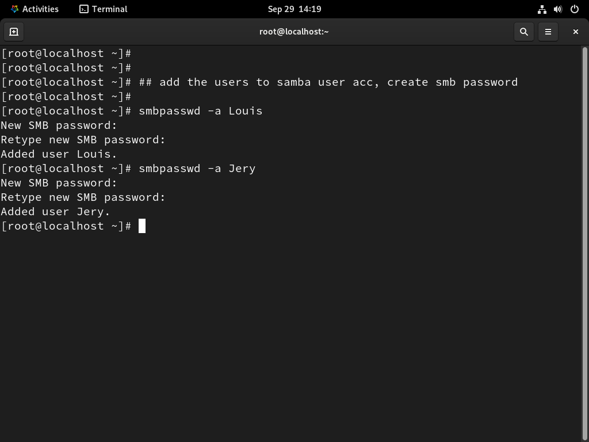
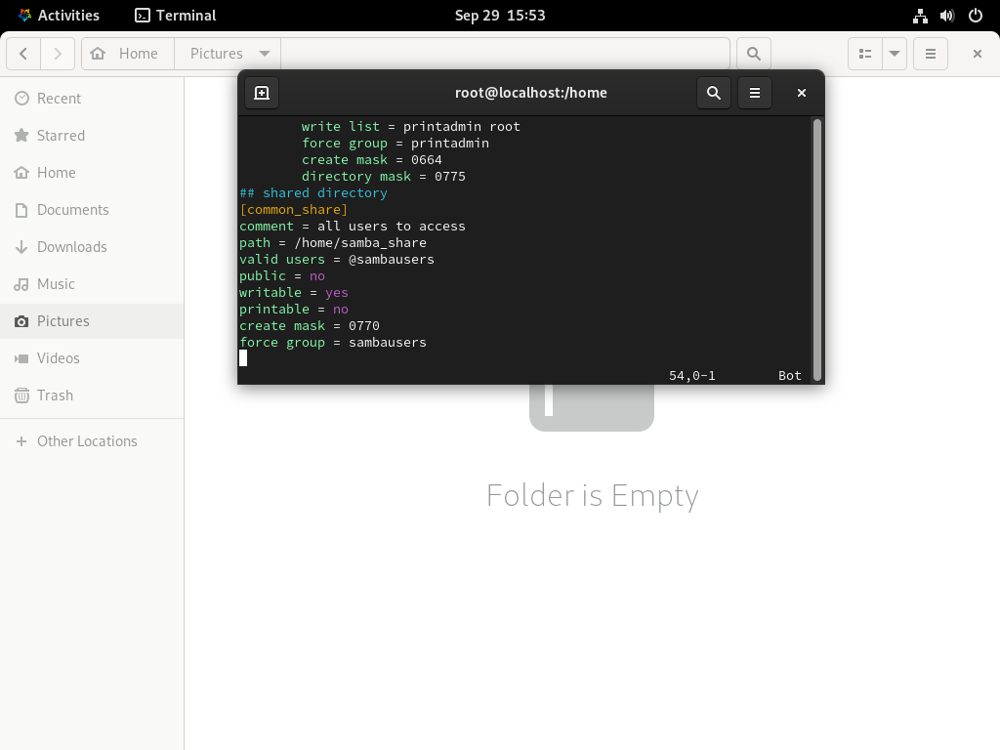
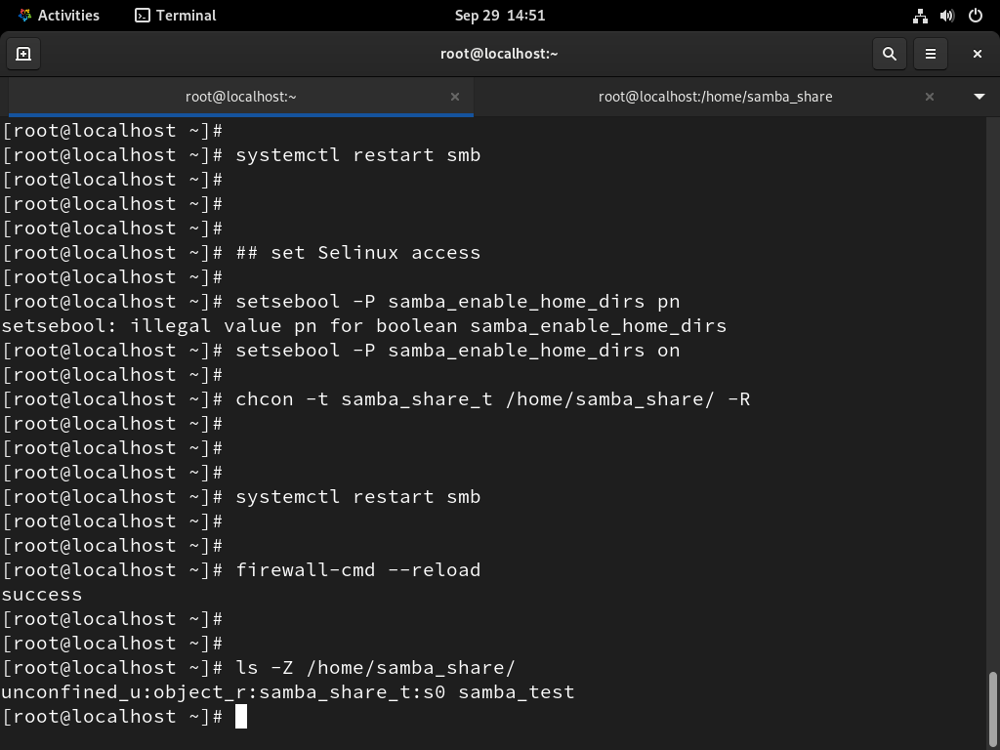

### MANUAL SAMBA SERVER

\*\*Priority Level\*\*: Medium

\*\*Estimated Time\*\*: 20 minutes

\*\*Required Access\*\*:

\*\*Risk Level\*\*:

#### Description

Samba is an open-source application suite which provides services such
as file and print to Server Message Block or Common Internet File System
clients.

#### Prerequisites

Alma Linux 9.6 Server (Installed and Running)

RedHat 9.6 Client (Installed and Running)

Windows 11 Client (Installed and Running)

Internet connectivity

Procedures: on the Server

1\. Check if samba is installed (and dependancies), if not Install it.

dnf install samba samba-client samba-common cups-libs

2\. Create a samba shared_directory:

mkdir -pv /home/samba_share

3**. **Create a group called “sambausers” that will share the directory
using the command:

groupadd sambausers

4\. Add users in the “sambausers” group created, so that they can access
the samba_share directory

useradd –g sambausers Louis

useradd –g sambausers Jerry

**5. **Create password for the two users added to the group and verify
the password when prompted

passwd Louis

passwd Jerry

:6. Add the users (Louis and Jerry) to Samba User Account and enter smb
password when ask to do so:

smbpasswd –a Louis

smbpasswd –a Jerry

7\. Configure the Samba Server Configuration file

* Instruction*:

1\. Open the samba file using vi /etc/samba/smb.conf

2\. Configure the samba global setting section in the smb.conf file to
allow client machine to access the samba services

8\. . Change the ownership, permissions of the shared directory and
restart the samba

chown -R root.sambausers /home/samba_samba

chmod 755 /home/sambare

9\. Set firewall and Selinux rules

setsebool -P samba_enable_home_dirs on

chcon -t samba_share_t /home/samba_share -R

firewal-cmd –add-service=samba –permanent

firewall-cmd –reload

